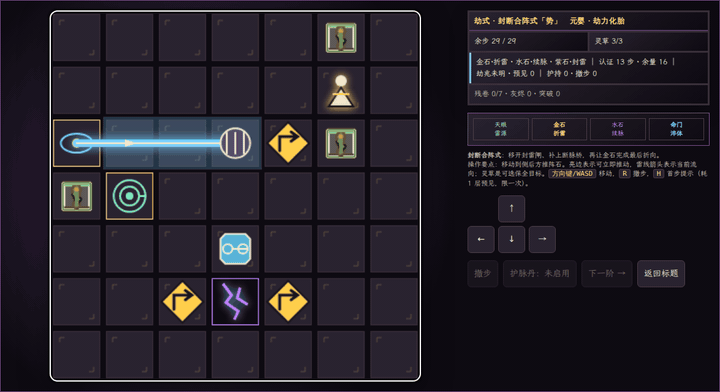
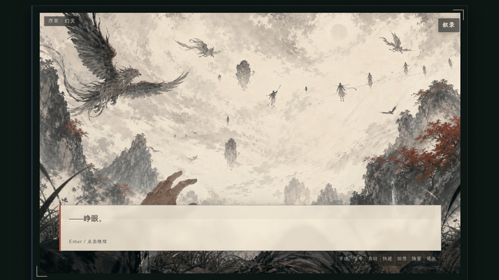

<p align="center">
  
</p>

<h1 align="center">永恒山谷：大道之歌 · Aeon Vale: Song of the Dao</h1>

<p align="center"><em>布阵引雷，以劫淬体；天道不给的路，用凡骨走出来。</em></p>

<p align="center">
  你被测灵柱判作“无灵根”，在边境山谷靠一块灵田谋生。<br>
  直到一卷残书指出一条反常识的路：主动引劫，把天罚炼成自己的资粮。
</p>

<p align="center">
  <a href="https://Rethymus.github.io/AeonVale/"><strong>▶ 立即在线试玩</strong></a> ·
  <a href="#一轮修途如何发生">核心循环</a> ·
  <a href="#两种修途">两种修途</a> ·
  <a href="#快速体验">本地运行</a> ·
  <a href="#开发者信息">开发者信息</a> ·
  <a href="#english-summary">English</a>
</p>

<p align="center">
  
</p>

<p align="center"><em>先看见下一道劫，再决定它如何落下。</em></p>

<p align="center">
  <a href="LICENSE"></a>
  <a href="CONTENT-LICENSE.md"></a>
  
  
  
  
</p>

---

## 这是一款什么游戏？

《永恒山谷：大道之歌》是一款中文原生单机游戏，将**修途筹备、炼丹制药与回合制雷阵解谜**串成同一条因果链。

你不是为了种田而种田：六段修途里的农事种出灵草，灵草进入丹药与雷阵，丹药与体魄扩大承雷的余地，阵石改写雷光的路，而天劫会把整段筹备变成突破——或代价。

主模式「偷天换劫」负责让你**玩进这个世界**；「灵韵叙录」则从另一个视角，让你**亲自走过这个故事**。两种玩法共享世界观与线索，但拥有各自完整的操作与节奏。

---

## 一轮修途，如何发生

| 阶段 | 你的决定 | 这一步为什么重要 |
|---|---|---|
| **择途** | 在六段修途中安排苦练、灵田、谋生与歇息；灵草、灵石攒够后再解锁炼丹与参悟 | 余寿、体魄、资源和心压不可能同时最优，重复同一件事还会收益递减 |
| **备劫** | 种植灵草、炼制丹药，在生活事件与残卷参悟中读懂即将到来的劫式 | 筹备的每件东西都会进入天劫棋盘，而不是孤立数值 |
| **布阵** | 推动折雷、续脉、封雷阵石，规划雷光的行路；一道劫可分多阶，逐阶推进 | 棋盘随种子变化，但认证步数、余量与撤步都摆在明处，规则不会临时变卦 |
| **承雷** | 在雷威的甜蜜区与肉身上限之间做取舍 | 落在甜蜜区是完美淬体，越过上限灰飞烟灭；一枚护脉丹能多换一次保命 |
| **留痕** | 成功进境，或在劫灰碑记留下知识、遗物与遗书，让下一位承火者接着叩天 | 失败不会把已学会的一切都抹掉 |

---

## 两种修途

### ⚡ 偷天换劫 · 修仙 roguelite 主模式

<p align="center">
  
</p>

<p align="center"><em>从容筹备：资源、体魄、伤势与下一劫，都在同一屏内做决定。</em></p>

**一颗心脏，两种心跳：从从容备劫，转入短促紧张的雷阵破局。**

- **阵法引雷就是 build**：金石折雷、水石续脉、紫石封雷；裂隙、导体、绝缘与灵草会改变同一道雷的意义。
- **随机决定局面，不暗改规则**：劫式由种子生成，每阶公示认证步数与移动余量，撤步随时回退；相同种子与输入可复盘同一场劫。
- **风险与收益共用一条雷路**：导开雷光可以保命，引雷入体才能淬体；雷威落在甜蜜区是完美淬体，越过肉身上限则当场灰飞烟灭。
- **引劫之问：何时承雷由你决定**：每轮备劫后都可以「现在引劫」或「再备一轮」——早引劫少耗余寿，却要接受当前准备；天道不会无限等待。
- **残卷参悟：把悟痕读成批注**：修途批注、引雷阵石、护脉丹方、紫劫兆拓、前人余声……一条从农事直通天劫情报的批注树。
- **六境是六次重写玩法边界**：练气、筑基、结丹、元婴、化神、归一——每次进境提高能力上限，并引入新的筹备项、劫式与阵场特性。
- **劫灰传承**：失败不是原地重复；劫灰碑记让你留下一页真正读懂的知识、一件遗物与一封遗书，下一位承火者带着它们重新入局。

> “无灵根”的判定究竟错在哪里？第一道劫，只是答案的开头。

### ✦ 灵韵叙录 · 第一人称分支叙事

<p align="center">
  
</p>

这不是主模式的剧情摘要，而是一条独立的互动叙事路径。屏幕前的你就是主角，在约一个安静时辰的旅程里，从凡骨叩天走到属于你的回答。

- **选择会被后文记住**：道心、旧伤、人物关系与已承受的代价会改变后续场景。
- **八种命数，不作简单好坏判定**：每种结局都回应一种对力量、记忆、牺牲与自我的理解。
- **章节轨与命数图鉴**：记录已走过的节点，也为尚未发现的道路留白。
- **同一世界，不同理解**：主模式用资源与棋盘决策塑造命运，叙录用阅读、选择与探索理解命运。

<p align="center">
  
</p>

<p align="center"><a href="https://Rethymus.github.io/AeonVale/"><strong>▶ 现在开始第一轮备劫</strong></a></p>

---

## 为什么不一样

| 体验创新 | 它如何改变你的决策 |
|---|---|
| **筹备与天劫是一个系统** | 灵田、丹药、体魄和阵图不是并列菜单，它们最终都会回到同一场雷劫 |
| **阵法引雷即角色 build** | 成长不只是数值上涨；你如何折、续、封一道雷，就是如何构筑这具凡骨 |
| **可预判的随机性** | 新劫式带来变化，明示目标与种子复现则让失败可学习、可解释 |
| **突破是玩法扩容，不只是属性涨幅** | 新境界提高上限，也加入新的日常选择、阵场特性与更复杂的风险结构 |
| **双视角讲述同一道命题** | 一条路让你在系统中反复破局，另一条路让你承担选择留下的痕迹 |

---

## 快速体验

**浏览器试玩**：打开 **<https://Rethymus.github.io/AeonVale/>**，无需安装。

**本地运行**：要求 Node.js 22 + pnpm 10；启动后不需联网功能。

```bash
pnpm install --frozen-lockfile
pnpm dev          # 打开 http://127.0.0.1:5173
```

标题屏的「开始游戏」进入「偷天换劫」；「✦ 灵韵叙录」进入第一人称叙事。当前浏览器版是完整的试玩与演示入口，Windows / Linux 安装版仍在规划中。

---

## 当前版本与下一步

- ✅ 「偷天换劫」已打通修途筹备、生活事件、残卷参悟、引劫之问、多阶天劫棋盘、进境突破与劫灰传承的完整循环。
- ✅ 「灵韵叙录」已提供完整章节轨、分支选择与八种命数。
- 🔄 正在打磨天劫解谜的手感、劫式多样性、引导可读性，并扩展残卷、阵石与灵草组合。
- 🔄 桌面端优先继续优化；Windows / Linux 封装是近期目标，移动端仅作后续评估。

---

## 开发者信息

产品体验之下是一套可复现、可自动验证的纯代码架构：

| 层 | 选型 | 服务的产品目标 |
|---|---|---|
| 语言 / 渲染 | TypeScript strict + PixiJS 8 | 同一套界面与输入系统支持桌面大屏和小横屏视口 |
| 模拟 | 纯函数 sim + 命名 PRNG 流 | 相同种子与输入得到一致状态，支持回放、定位与平衡调参 |
| 内容 | Zod schema + 数据表 + i18n 键值层 | 新灵草、丹药、事件和阵石可系统化扩展 |
| 音频 | Tone.js + Web Audio | 程序化合成为主，按场景混合少量精选音频 stem |
| 验证 | Vitest + fast-check + Playwright | 2700+ 个单元、属性、集成、回放、无头与浏览器测试 |

<details>
<summary><strong>查看确定性、自动平衡与工程命令</strong></summary>

### 架构约束

```text
src/sim       确定性核心模拟 —— 纯函数、零 DOM/GPU/IO/时间依赖
src/render    PixiJS 表现层   —— 落雷几何、震屏与粒子不污染 sim
src/app       流程与界面      —— 标题流程、两模式 surface、输入路由
src/content   数据驱动内容    —— schema、注册表与简体中文本地化
src/io        平台 IO          —— Web Audio 音频引擎
```

- `mulberry32` + 命名 RNG 流使逻辑状态可重现；表现层的闪电形状与粒子可以非确定，但不改变结算。
- Golden Replay 与 `stateHash` 守护存档往返和行为兼容。
- `pnpm balance` 运行蒙特卡洛扫描；`pnpm tune` 用 CMA-ES / NSGA-II 搜索平衡参数；`pnpm m5:check` 验收战役难度曲线。
- 无头 sim 支持批量代理测试；LLM 可作为只读 playtester 评判回放轨迹，不进入 `src/sim/`。

### 常用命令

```bash
pnpm build              # 类型检查 + 生产构建
pnpm typecheck          # 仅类型检查
pnpm test               # 全量测试
pnpm test:fast          # 单元 + 属性
pnpm test:replay        # Golden 回放
pnpm content:lint       # 内容 schema 与本地化校验
pnpm governance:check   # 治理与泄露检查
pnpm headless           # 无头跑完整 sim
pnpm readme:media       # 用 Playwright + ffmpeg 重生成 README 截图与 GIF
```

</details>

---

## 项目结构

| 目录 | 职责 |
|---|---|
| `src/sim/` | 确定性核心模拟（零 DOM/GPU 依赖） |
| `src/render/` | PixiJS 8 表现层 |
| `src/app/` | 流程、界面与两模式 surface |
| `src/content/` | 内容定义、Zod schema、中文本地化 |
| `src/io/` | Web Audio 音频引擎与平台 IO |
| `tools/` | 内容校验、平衡扫描、自动调参与发布工具 |
| `tests/` | unit / property / integration / replay / headless / browser |
| `assets/` | 运行时美术、音频与 manifest |

---

## 贡献、安全与许可

- 提交、分支、PR 与发布规则见 [`CONTRIBUTING.md`](CONTRIBUTING.md)。
- 安全问题请按 [`SECURITY.md`](SECURITY.md) 私下报告。
- **源代码**使用 [MIT License](LICENSE)；**原创叙事、数据与美术**使用 [CC BY-NC 4.0](CONTENT-LICENSE.md)，二次使用请分别遵守对应条款。
- 公开发布只使用经过检查的公开树，不上传私有设计资料、Agent 状态、密钥或生产 sourcemap。

<details>
<summary><strong>维护者：公开发布与验收</strong></summary>

## 公开优先级

**P0 公开试玩版与 GitHub Pages 部署**的验收目标是：访客能理解今日优先级、跑通最小闭环，并且公开产物不泄露私有内容。

### 当前进度快照

- **P0-A 本地可审版本**：只有在全量测试、构建、治理审查与公开树验证通过后才视为就绪。
- **P0-B GitHub Pages 公开展示**：与本地就绪分开判定；**真实 Pages URL 必须在重新部署后通过 `pnpm test:browser:pages`**，才可确认线上闭环。
- **后续若转为 Public、创建 Release 或修改远端设置，仍需要维护者当次明确授权**。

### 公开试玩验收清单

- 玩家知道今天先做什么，并能完成一次可理解的资源与修途闭环。
- 桌面端与小横屏视口的核心画布完整可见，关键输入有独立浏览器烟测。
- GitHub Pages 构建不泄露设计资料、Agent 状态、密钥、真实邮箱、未筛选生成物或生产 sourcemap。

### 公开树与本地证据

```bash
pnpm audit:public-worktree
pnpm audit:public-content
pnpm prepare:public-tree <目标目录>
pnpm verify:public-tree
pnpm portfolio:mvp-preflight -- --keep-public-tree
```

`portfolio:mvp-preflight` 会重新捕获证据、验证公开树、输出状态矩阵，并**打印非部署发布清单**；“**维护者发布清单回显**”是本地 MVP 预检证据的一部分。这些命令本身不提交、不推送、不部署。

```bash
pnpm portfolio:capture
pnpm test:browser:smoke
pnpm test:browser:keypoint
pnpm portfolio:status
pnpm portfolio:status -- --json
pnpm portfolio:release-checklist
pnpm portfolio:release-checklist -- --json
```

机读状态的 `evidenceArtifacts` 包含 `public-demo-evidence-json`、`public-demo-screenshot-set` 和 `live-pages-smoke`；机读发布清单用 `requiredEvidence` 列出证据，用 `authorizationRequired` 标明远端授权闸门。审查截图生成在 `test-results/portfolio/`，证据 JSON 为 `test-results/portfolio/portfolio-mvp-evidence.json`；审查时检查 `runtimeSignals.todayBriefingProof`，以及截图的**非空绘制比例、颜色数**。**该目录属于生成物，不进入公开树**。

### Pages 发布后复验

```bash
pnpm portfolio:pages-diagnose
pnpm portfolio:pages-watch
pnpm portfolio:pages-watch -- --wait --json
pnpm test:browser:pages
pnpm test:browser:pages-playable
```

`portfolio:pages-diagnose` 是非部署诊断，只检查**部署漂移、线上旧 bundle、GitHub Action 状态**；`portfolio:pages-watch` 只读观察 **CI、Pages Action、github-pages deployment、Pages Source 和线上 bundle**，`--wait --json` 是有超时上限的机读等待模式。它们都不触发工作流、不修改远端设置。

</details>

---

## English Summary

**Aeon Vale: Song of the Dao** is a Chinese-first single-player game that links cultivation planning, alchemy, and turn-based lightning-routing puzzles into one causal loop.

- **Heaven-Stealing Tribulation** is the main cultivation roguelite. Draft a six-slot agenda of multi-day activities, weigh when to call the tribulation down, then push array stones to route a staged, seeded lightning strike through herbs and into a mortal body — aiming for the perfect-quench sweet spot without overloading a body that has no spiritual root. Randomness creates the board; visible rules, certified move counts, and reproducible seeds keep failure learnable.
- **Lingyun Narration** is a separate first-person branching story set in the same world. Choices, wounds, relationships, and sacrifices lead toward eight thematically distinct fates without reducing them to simple good or bad endings.

Built with TypeScript, PixiJS 8, Tone.js / Web Audio, Zod, Vite, deterministic simulation, automated balance sweeps, and 2700+ tests. The browser demo needs no installation; a local run does not depend on online services. Source code is MIT-licensed, while original narrative and art use CC BY-NC 4.0.

---

<p align="center"><em>天劫已经落下。下一步雷光往哪里走，由你决定。</em></p>

<p align="center"><a href="https://Rethymus.github.io/AeonVale/"><strong>▶ 在浏览器中开始修行</strong></a></p>
